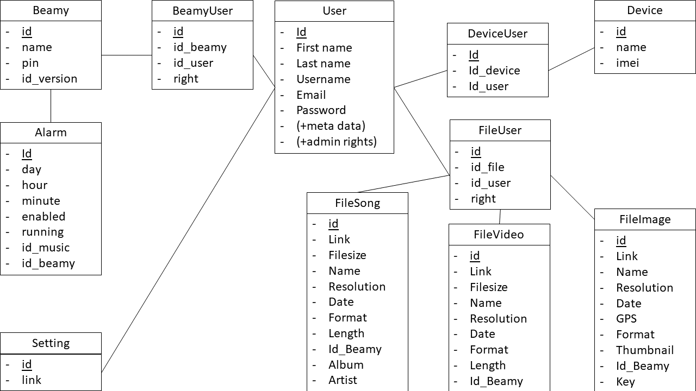

# Getting started

## Table of contents

* [Setup Django for developpement testing](#setup-django-for-developpement-testing)
* [Database](#database)
* [Endpoints](#endpoints)
  * [Alarm](#alarm)
    * [Retrieve alarm list](#retrieve-alarm-list)
    * [Add alarm](#add-alarm)
    * [Delete alarm](#delete-alarm)
* [Comments](#comments)

## Setup Django for developpement testing

First make sure to install properly `python 3.6.4` and `Django 2.0`. The procedure varies depending on your operating system.<br>Be sure to also install `lxml 4.1.1` for python. The easiest way is to install `pip` and run `pip install lxml==4.1.1`.

Clone/pull/download the repo.

Go to the project root directory.

Synchronize the databases

```sh
python manage.py migrate
```

Create a `superuser` account to acces the admin page

```sh
python manage.py createsuperuser # only before first run
```

Run the server

```sh
python manage.py runserver 0.0.0.0:8000
```

> NB : on linux systems, use `python3/pip3` instead of `python/pip`.

> NB : the server can't be deployed in production right away. Some security precautions are to be taken. Use these instruction only for testing purposes.

## Database

We have implemented the database using the default `sqlite3` server.

The current state of the tables is shown in the image below. The `User` table is different as we didn't implement it ourself. It is managed by default by Django. All other tables are defined in `/back/BDD/models.py`.



## Endpoints

The mobile device and the connected object transfert relevant data with the server using an API we designed.

### Alarm

All `xml` files with alarm data embedded have the same basis structure :

```xml
<alarm>
	<alarm_id>alarm id</alarm_id>
	<beamy_id>beamy id</beamy_id>
	<time>
		<day>any subset of {monday, tuesday, wednesday, thursday, friday, saturday, sunday}</day>
		<hour>hour between 0 and 23</hour>
		<minute>minute between 0 and 59</minute>
	</time>
	<state>an element of {set, unset, running}</state>
</alarm>
```

All values are treated as strings and no quotation marks are needed

#### Retrieve alarm list

* **URL :**


  `GET ~/api/alarm/int:id`

* **URL Param :**

  `id`, optional

* **Data Param :**

  None


* **Success reponse :**

  Code : 200

  Content : `text/xml`

  ```xml
  <?xml version="1.0"?>
  <set>
      <alarm>
          <alarm_id>1</alarm_id>
          <beamy_id>1</beamy_id>
          <time>
              <day>lundi, mardi</day>
              <hour>8</hour>
              <minute>3</minute>
          </time>
          <state>set</state>
      </alarm>
      <alarm>
      ...
      </alarm>
  </set>
  ```

* **Error response :**

  Code : 404

  Returned if `id` does not correspond to any internal alarm id

* **Sample Call :**

  ```sh
  curl -H "Accept: text/xml" -H "Content-Type: text/xml" -X GET http://localhost:8000/api/alarm/7/
  ```

* **Notes**

  When a valid `id` parameter is used, the response xml contain only the alarm which internal id is `id`:

  ```xml
  <?xml version="1.0"?>
  <set>
  	<alarm>
          <alarm_id>id</alarm_id>
          <beamy_id>1</beamy_id>
          <time>
              <day>lundi, mardi</day>
              <hour>8</hour>
              <minute>3</minute>
          </time>
          <state>set</state>
      </alarm>
  </set>
  ```


#### Add alarm

- **URL :**

  `POST ~/api/alarm/`

- **URL Param :**

  None

- **Data Param :**

  Content : `text/xml`

  ```xml
  <?xml version="1.0" ?> 
  <alarm>
  	<beamy_id>2</beamy_id>
  	<time>
  		<day>mercredi</day>
  		<hour>9</hour>
  		<minute>56</minute>
  	</time>
  	<state>set</state>
  </alarm>
  ```


- **Success reponse :**

  Code : 200

  Content :  `text/html`
  
  ```xml
  <?xml version="1.0" ?> 
  <alarm>
  	<alarm_id>9</alarm_id>
  	<beamy_id>2</beamy_id>
  	<time>
  		<day>mercredi</day>
  		<hour>9</hour>
  		<minute>56</minute>
  	</time>
  	<state>set</state>
  </alarm>
  ```

- **Error response :**

  <_Not yet implemented_>

- **Sample Call :**

  ```sh
  curl -X POST -d @new_alarm.xml http://localhost:8000/api/alarm/
  ```


#### Delete alarm

- **URL :**

  `DELETE ~/api/alarm/int:id`

- **URL Param :**

  `id`, required

- **Data Param :**

  None


- **Success reponse :**

  Code : 200

  Content :  "hello"

- **Error response :**

  Code : 404

  Returned if `id` does not correspond to any internal alarm id

- **Sample Call :**

  ```sh
  curl -X DELETE http://localhost:8000/api/alarm/5/
  ```

## Comments

Timezones are not yet well managed. We need to make sure each alarm rings at the right time in the right timezone.
For example, we live in `Europe/Paris` but Django default timezone is `UTC`.